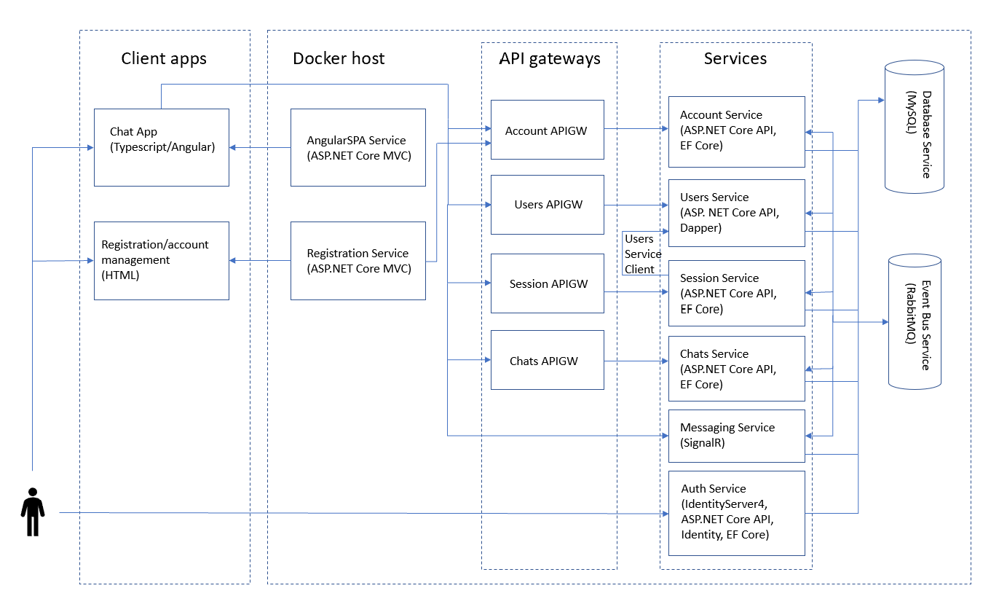

# SecureChat
This is a toy application that I created to learn and experiment with the microservice architecture with .NET Core. It is a peer-to-peer chat application that allows users to communicate with friends via chatrooms and private chats.

## Architecture
The architecture of this project is based on the [eShopOnContainers](https://github.com/dotnet-architecture/eShopOnContainers) reference application by Microsoft, with some changes. Similar unit/integration testing conventions are followed.

## Services
The application is comprised of a number of autonomous services that communicate primarily via integration events dispatched through a RabbitMQ event bus.

#### Authentication Service
This service provides OIDC authentication using IdentityServer4. The Angular client application is configured to use the Implicit authentication workflow.

#### Account Service
This service is responsible for handling all user account management tasks (registration, email verification, password reset, etc.), which are implemented as custom APIs. It is also responsible for managing user permissions, which are issued and stored as Identity claims.

#### Session Service
This service is responsible for processing user activity events (connected, disconnected, chat activity). It provides APIs for querying user chat session status (online/offline/idle) and publishes the appropriate integration events to notify users of friends' session changes. The session service departs from the eShopOnContainers architecture in one important way: it communicates with the Users Service synchronously using a service client library.

#### Users Service
This service is responsible for chat-related user tasks, including management of friendship requests, management of friendships, and creation and editing of profile information. The service uses DDD and CQRS patterns. A service client library that can be consumed from other services for synchronous communication with the Users service is also implemented. [Flyway](https://github.com/flyway/flyway) is used for database migrations.

#### Messaging Service
This service enables realtime communication with client applications using the SignalR library. It consumes specific integration events by other services and forwards them to the specified connected clients. This model offers a very flexible way of communicating with client applications. The SignalR hub is also being used as a hook for detecting when a user connects to or disconnects from the chat application.

#### Chats Service (Work In Progress)
This service is responsible for user-user communication by means of private chats or chatrooms. This includes creating new chats, joining and leaving chats, and sending chat messages.

## Client Applications

#### Angular Single-Page App
The main chat application is implemented as an Angular2+ SPA. Internally, this client application utilizes an event-based architecture with NgRx.

#### Registration/User Management App
This app is essentially a frontend for the Account service. It handles such functionality as registration, email verification, and password reset.

## Database
The single MySQL database service hosts all of the databases used by the microservices: auth db, account db, users db, session db, and chat db. Having a single database service reduces the startup time, so this approach was preferred for the purposes of this application.

## API Gateways
All external APIs pass through API gateways. The API gateways are implemented declaratively using [Ocelot](https://github.com/ThreeMammals/Ocelot).

## Authorization
All services rely on claim-based authorization. User permissions are encoded as claims. Authorization is bypassed for inter-service communication, such as between the Session service and the Users service.